# Brief-Sync

**A fine-tuned T5 transformer that turns long dialogue and articles into concise summaries, served through a FastAPI backend behind a custom animated web UI.**


---

## Screenshots

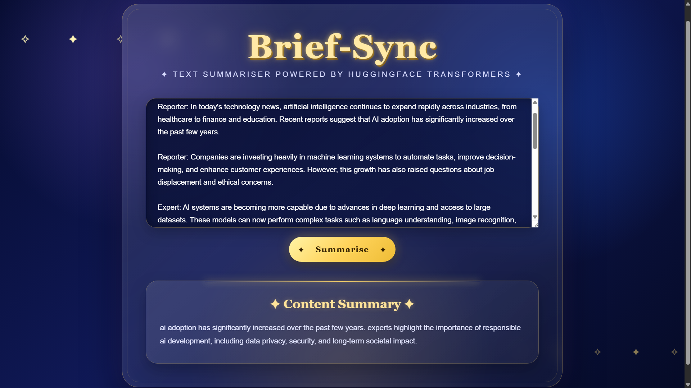

## Problem Statement

Long-form text — meeting transcripts, chat threads, articles — takes real time to read before anyone can act on it. Generic extractive "first three sentences" summarizers miss the actual point of a conversation, and general-purpose LLM APIs are overkill (and cost money per call) for a narrowly-scoped summarization task.

## Solution Overview

Brief-Sync fine-tunes a T5 sequence-to-sequence model specifically on the [SAMSum dataset](https://huggingface.co/datasets/samsum) (real-world-style dialogue paired with human-written summaries), then serves that fine-tuned model through a lightweight FastAPI backend. A single-page vanilla HTML/CSS/JS frontend sends raw text to the API and renders the generated summary — no external LLM API, no per-call cost, and a model specialized for dialogue/article summarization rather than general chat.

## Key Features

| Feature | Description |
|---|---|
| Fine-tuned T5 model | Trained specifically on the SAMSum dialogue-summarization dataset (not a generic off-the-shelf checkpoint) |
| REST API | Single `POST /summarize/` endpoint, JSON in/out |
| Self-contained frontend | One `index.html` with inline CSS/JS — no build step, no framework |
| CPU-friendly inference | Beam search (`num_beams=4`) tuned to run acceptably without a GPU |
| Text preprocessing | Regex-based cleanup (line breaks, whitespace, HTML tags, casing) before tokenization |
| Container-ready | Dockerfile + CPU-only PyTorch build for Hugging Face Spaces / any container host |

## Overall Architecture

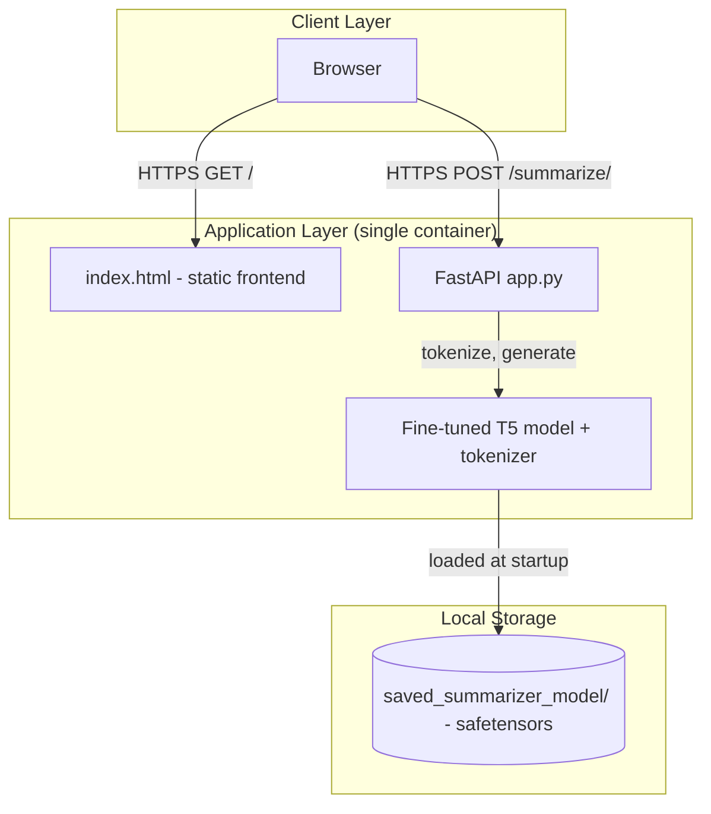

## System Architecture

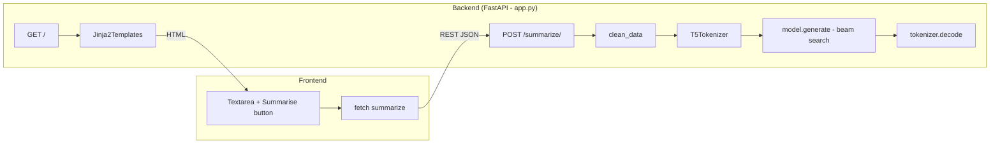

## Technology Stack — Complete Breakdown

| Technology | Version | Category | Purpose in Project | Why Chosen | Key Features Used |
|---|---|---|---|---|---|
| FastAPI | 0.141.1 | Backend Framework | Serves the HTML page and the `/summarize/` REST endpoint | Async-friendly, automatic request validation via Pydantic, minimal boilerplate | `@app.get`, `@app.post`, `Request`, dependency-free routing |
| Uvicorn | 0.52.4 | ASGI Server | Runs the FastAPI app, hot-reloads in dev | Standard ASGI server for FastAPI, `--reload` for local dev | `uvicorn app:app --reload`, standard extras for perf |
| Pydantic | 2.13.5 | Data Validation | Validates the incoming `{"dialogue": "..."}` request body | Ships with FastAPI, declarative schema via `BaseModel` | `DialogueInput(BaseModel)` |
| Transformers (Hugging Face) | 4.46.0 (pinned for deploy) | ML Framework | Loads the fine-tuned T5 model + tokenizer, runs generation | Industry-standard for loading/serving transformer checkpoints locally | `T5ForConditionalGeneration.from_pretrained`, `T5Tokenizer.from_pretrained`, `model.generate` (beam search) |
| PyTorch | 2.5.1 (CPU build for deploy) | ML Framework | Tensor ops and inference runtime under Transformers | Required by Transformers for the model's forward pass; CPU wheel keeps the container small | `torch.device`, `torch.cuda.is_available`, `torch.backends.mps.is_available`, `.to(device)` |
| SentencePiece | 0.2.0 | Tokenization backend | T5's tokenizer depends on it for subword tokenization | Required dependency of `T5Tokenizer` | Loaded implicitly via `tokenizer.json` / `tokenizer_config.json` |
| Jinja2 | 3.1.4 | Templating | Renders `index.html` through FastAPI's `Jinja2Templates` | Bundled default templating engine for FastAPI | `templates.TemplateResponse` |
| Vanilla HTML/CSS/JS | — | Frontend | The entire UI — form, styling, fetch call | No build tooling needed for a single-page utility app | `fetch()`, CSS gradients/backdrop-filter, `FormData`-free JSON POST |
| Docker | — | Containerization | Packages app + model weights for Spaces/any host | Portable, reproducible build across dev machine and deployment target | Multi-stage-free single `Dockerfile`, `.dockerignore` to exclude training data |
| Google Colab | — | Training environment | Where the T5 model was fine-tuned (see `BriefSync_Colab_Finetune.ipynb`) | Free GPU access for fine-tuning without local hardware | Notebook-based training loop, checkpoint export to `saved_summarizer_model/` |
| pandas (training pipeline) | — | Data Processing | Reads `samsum-train/test/validation.csv` for fine-tuning | Standard for tabular dataset loading before tokenization | `read_csv`, dataframe → HF `Dataset` conversion (in `train_summarizer.py`) |

> *Training-side dependencies (pandas, datasets, accelerate, etc.) are inferred from `train_summarizer.py` / the Colab notebook and aren't required at inference time, so they're intentionally left out of the deployment `requirements.txt`.*

## Request Lifecycle

### 1. `GET /` — Loading the app

```
1. Browser requests http://host/
2. FastAPI route: @app.get("/") -> home(request)
3. Jinja2Templates renders index.html from the working directory
4. HTML (with inline CSS/JS) returned to the browser
5. Browser parses page, no further backend calls until the user submits text
```

### 2. `POST /summarize/` — Generating a summary

```
1. USER INTERACTION
   User pastes text into the <textarea>, clicks "Summarise"
   -> JS: form "submit" listener in index.html preventDefault()s and reads dialogueInput.value

2. FRONTEND API CALL
   fetch("http://127.0.0.1:8000/summarize/", { method: "POST", headers: {"Content-Type": "application/json"},
         body: JSON.stringify({ dialogue }) })

3. CORS PREFLIGHT (cross-origin only)
   Browser sends OPTIONS /summarize/ first
   -> CORSMiddleware (added in app.py) answers with allowed origin/methods/headers
   -> Browser proceeds to the real POST

4. BACKEND — ROUTING
   FastAPI matches POST /summarize/ -> summarize(dialogue_input: DialogueInput)
   -> Pydantic validates the body against DialogueInput { dialogue: str }; 422 on bad shape

5. PREPROCESSING
   summarize_dialogue() calls clean_data(dialogue)
   -> regex: normalizes line breaks, collapses whitespace, strips HTML tags, lowercases

6. TOKENIZATION
   tokenizer(dialogue, padding="max_length", max_length=512, truncation=True, return_tensors="pt")
   -> tensors moved to the resolved device (mps / cuda / cpu)

7. MODEL INFERENCE
   model.generate(input_ids, attention_mask, max_length=150, num_beams=4, early_stopping=True)
   -> beam search decoding on the fine-tuned T5 weights

8. DECODING
   tokenizer.decode(targets[0], skip_special_tokens=True) -> plain-text summary

9. RESPONSE
   FastAPI returns {"summary": "..."} as JSON

10. FRONTEND RENDERS RESULT
    response.json() -> summaryText.innerText = data.summary
    Button re-enabled in the finally block; errors caught and shown inline as "Error: ..."
```

**Error path:** invalid JSON body → FastAPI returns `422 Unprocessable Entity` before `summarize()` ever runs; any exception during preprocessing/inference currently propagates as a `500` (not yet caught with a try/except in the route — see *Future Roadmap*).

## Data Flow

```
Textarea input -> JS fetch (JSON) -> FastAPI route -> Pydantic validation
  -> clean_data() (regex normalization) -> T5Tokenizer (text -> input_ids/attention_mask)
  -> T5ForConditionalGeneration.generate() (input_ids -> output token ids, beam search)
  -> T5Tokenizer.decode() (token ids -> text) -> JSON response -> DOM update
```

There is no database and no persisted state: every request is stateless, and the model is loaded into memory once at process startup (`from_pretrained` runs at import time, not per-request).

<details>
<summary>📐 UML Diagrams — Full Suite (9 Diagrams)</summary>

**1. Use Case**
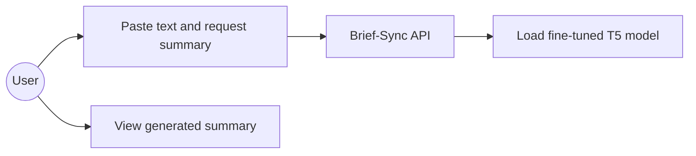

**2. Class Diagram**
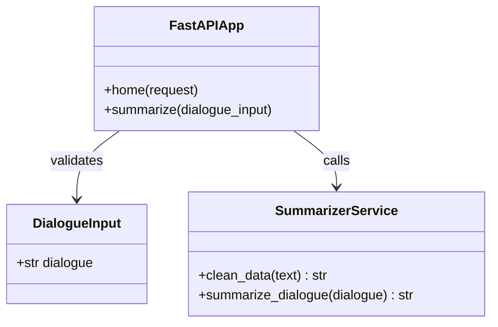

**3. Sequence Diagram**
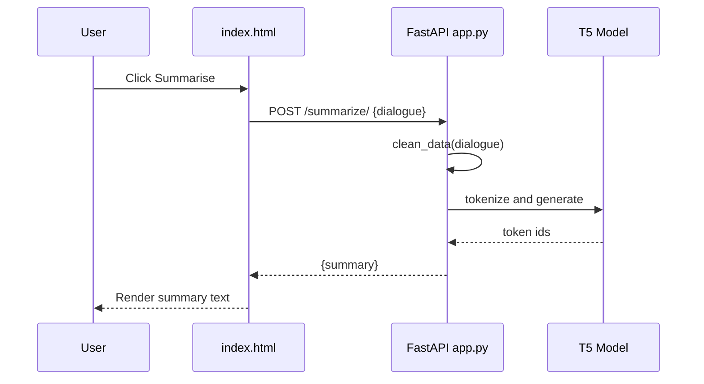

**4. Collaboration Diagram**
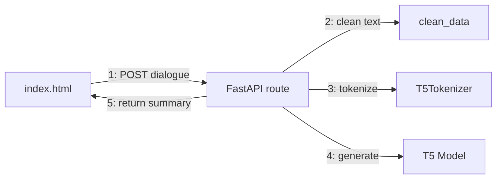

**5. Activity Diagram**
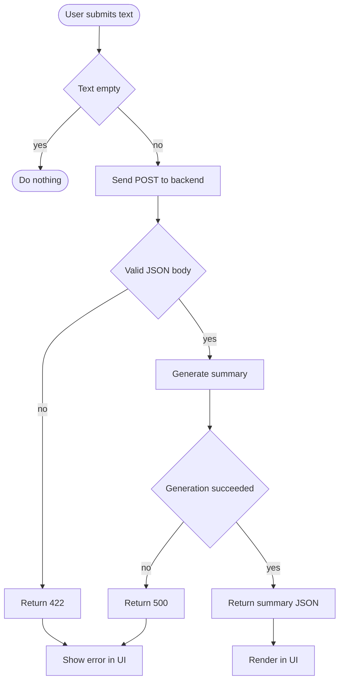

**6. State Diagram (a single request)**
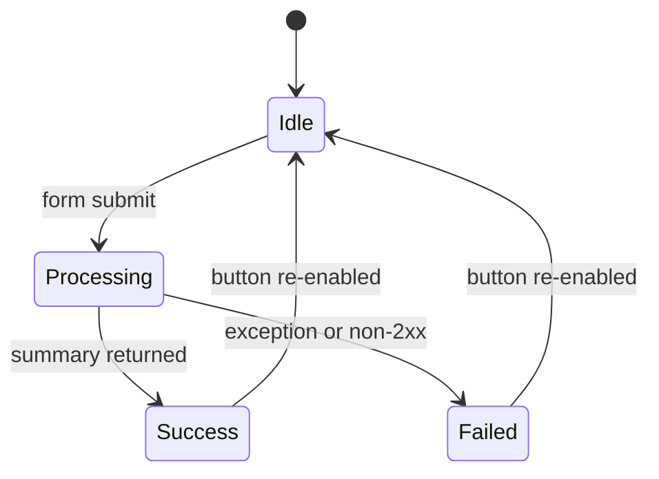

**7. Component Diagram**
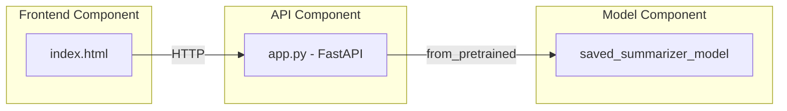

**8. Deployment Diagram**
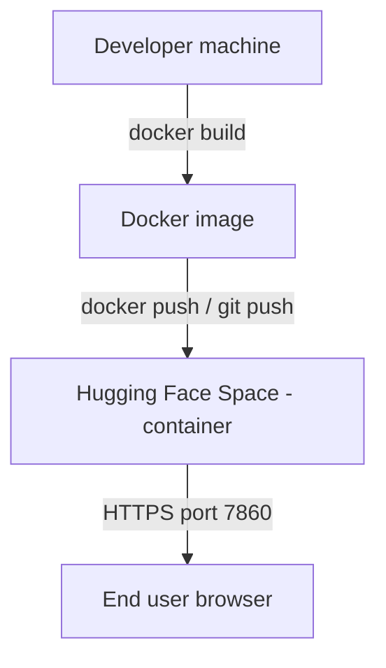

**9. Package Diagram**
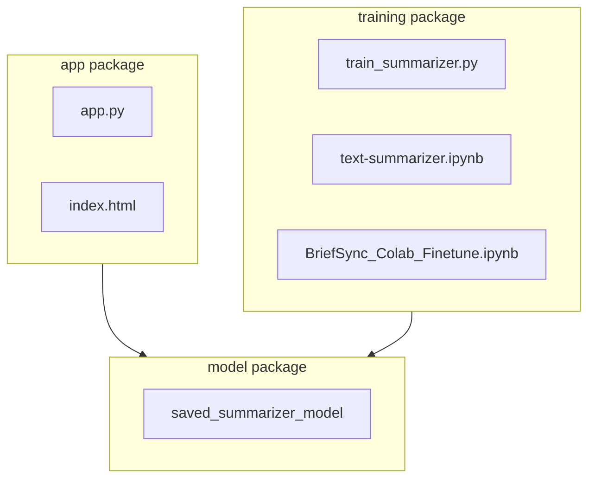

</details>

<details>
<summary>📊 Data Flow Diagrams</summary>

**DFD Level 0 (Context)**
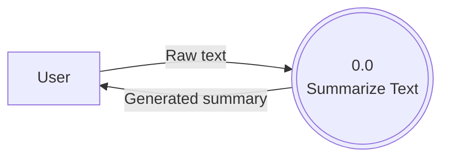

**DFD Level 1**
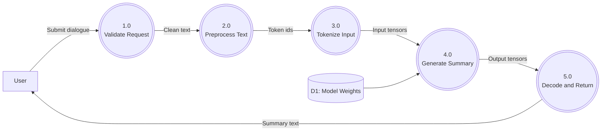

</details>

## Folder Structure

```
brief-sync/
├── app.py                        # FastAPI backend: routes, preprocessing, inference
├── index.html                    # Single-page frontend (inline CSS/JS)
├── train_summarizer.py           # Standalone fine-tuning script
├── text-summarizer.ipynb         # Exploratory / training notebook
├── BriefSync_Colab_Finetune.ipynb# Colab-specific fine-tuning notebook
├── samsum-train.csv              # SAMSum training split (excluded from Docker image)
├── samsum-test.csv               # SAMSum test split
├── samsum-validation.csv         # SAMSum validation split
├── saved_summarizer_model/       # Fine-tuned T5 weights + tokenizer (config.json, model.safetensors, tokenizer.json, ...)
├── results/                      # Training run outputs
├── requirements.txt              # Inference dependencies (added for deployment)
├── Dockerfile                    # Container build for Hugging Face Spaces / any host
├── .dockerignore                 # Excludes training data, venv, notebooks from the image
└── .gitignore
```

## Prerequisites

- Python 3.11+ (3.13 used in local dev)
- `pip` / `uv` for dependency installation
- ~1 GB free disk for the fine-tuned model + PyTorch CPU wheel
- Docker (only if deploying via container)

## Installation (local)

```bash
git clone https://github.com/KARTHIKAKRISHNA123/brief-sync.git
cd brief-sync

python -m venv .venv
source .venv/Scripts/activate      # Windows Git Bash
# source .venv/bin/activate        # macOS/Linux

pip install -r requirements.txt
pip install torch --index-url https://download.pytorch.org/whl/cpu   # or the CUDA build if you have a GPU

uvicorn app:app --reload
```

Visit `http://127.0.0.1:8000/` for the built-in UI, or POST directly to `/summarize/`.

## Environment Variables

None currently required — the model path is hardcoded to `./saved_summarizer_model` and the server binds to all interfaces on whatever port `uvicorn` is given. A future iteration could externalize the model path and allowed CORS origins via env vars (see Roadmap).

## API Documentation

| Method | Path | Body | Response | Notes |
|---|---|---|---|---|
| `GET` | `/` | — | `text/html` | Renders `index.html` via Jinja2 |
| `POST` | `/summarize/` | `{"dialogue": "string"}` | `{"summary": "string"}` | 422 on malformed body; CORS-enabled for cross-origin frontends |

## Database Schema

Not applicable — the app is stateless. No database is used; the only persisted artifact is the model checkpoint on disk.

## Authentication Flow

Not applicable — the API is currently open (no auth layer). Anyone who can reach the deployed URL can call `/summarize/`. See *Security Considerations* below.

## ML Pipeline

1. **Data**: SAMSum dataset (`samsum-train.csv`, `samsum-validation.csv`, `samsum-test.csv`) — dialogue/summary pairs.
2. **Preprocessing**: regex cleanup (line breaks, whitespace, HTML strip, lowercasing) — the same `clean_data()` logic is reused at both training and inference time for consistency.
3. **Fine-tuning**: T5 base model fine-tuned on SAMSum, run in `train_summarizer.py` / `BriefSync_Colab_Finetune.ipynb` (Colab GPU).
4. **Checkpointing**: best checkpoint exported to `saved_summarizer_model/` in `safetensors` format (242 MB).
5. **Inference**: `T5ForConditionalGeneration.generate()` with beam search (`num_beams=4`, `max_length=150`, `early_stopping=True`).

## Results

Fine-tuned for 10 epochs (2500 steps) on the SAMSum training split. Training loss and validation loss both decreased steadily and converged by the final epochs, with no sign of overfitting (validation loss tracks training loss closely throughout):

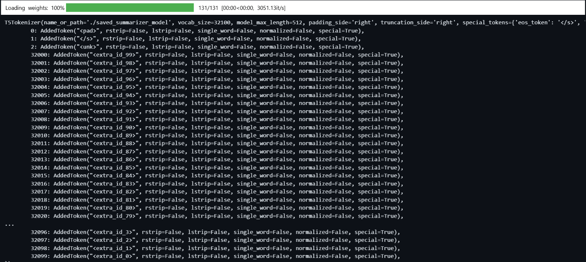

| Epoch | Training Loss | Validation Loss |
|---|---|---|
| 1 | 0.670051 | 0.509501 |
| 2 | 0.416336 | 0.375229 |
| 3 | 0.394731 | 0.362046 |
| 4 | 0.382074 | 0.355475 |
| 5 | 0.363275 | 0.352786 |
| 6 | 0.376942 | 0.349974 |
| 7 | 0.342354 | 0.348663 |
| 8 | 0.344172 | 0.348199 |
| 9 | 0.347648 | 0.347826 |
| 10 | 0.346260 | 0.347546 |

> ROUGE-1/2/L scores aren't computed yet — worth adding if this goes further (see Roadmap).

## Security Considerations

- No authentication/rate-limiting on `/summarize/` — a public deployment is open to arbitrary text submission and repeated calls.
- CORS is currently permissive during development; **lock `allow_origins` down to the real deployed frontend origin(s) before going to production.**
- No input length cap before tokenization beyond the tokenizer's own truncation — very large payloads still cost full preprocessing time.
- Model inference has no per-request try/except yet, so a malformed or edge-case input can surface a raw 500 traceback (see Roadmap).

## Performance & Scalability

- Model is loaded once at process startup, not per-request — the expensive part (`from_pretrained`) happens a single time.
- CPU inference with beam search (`num_beams=4`) is noticeably slower than GPU; acceptable for a demo/portfolio load, not tuned for high concurrency.
- Uvicorn's default single worker is fine for low traffic; a real deployment would add `--workers` or a process manager (gunicorn+uvicorn workers) behind a reverse proxy.

## Deployment Guide

### Local
See *Installation* above.

### Docker (any host)
```bash
docker build -t brief-sync .
docker run -p 7860:7860 brief-sync
```

### Hugging Face Spaces (Docker SDK)
1. Create a new Space at huggingface.co/new-space, SDK = **Docker**.
2. Push this repo's `Dockerfile`, `requirements.txt`, `app.py`, `index.html`, and `saved_summarizer_model/` to the Space's git remote (Spaces support Git LFS natively for the 242 MB `model.safetensors`).
3. The Space's own `README.md` needs YAML frontmatter (`sdk: docker`, `app_port: 7860`) — kept separate from this repository's README.

## Testing Strategy

No automated tests currently exist. A minimal starting point would be `pytest` + FastAPI's `TestClient` covering: a valid `/summarize/` call, a malformed body (expect 422), and an empty-string dialogue.

## Troubleshooting Guide

| Symptom | Cause | Fix |
|---|---|---|
| `HFValidationError: Repo id must use alphanumeric chars...` | `from_pretrained()` path doesn't match the actual model folder name on disk | Make sure the string passed to `from_pretrained` matches the real folder name exactly |
| `AttributeError: module 'torch' has no attribute 'backend'` | Typo — PyTorch's device-check module is `torch.backends`, not `torch.backend` | Use `torch.backends.mps.is_available()` |
| Browser shows `Error: Failed to fetch` | Missing CORS middleware — the browser's `OPTIONS` preflight gets `405` | Add `CORSMiddleware` to the FastAPI app before defining routes |
| `uvicorn: Got unexpected extra argument (app)` | Extra space in `uvicorn app: app --reload` | Use `uvicorn app:app --reload` (no space around the colon) |
| `'import' is not recognized...` / `Unable to initialize device PRN` when checking CUDA | Python code (`import torch`, `print(...)`) typed directly into Windows **CMD**, which isn't a Python interpreter | Run `python` first to drop into the `>>>` interactive shell, *then* run the `import torch` / `torch.cuda.is_available()` checks there. See *GPU/CUDA Check* below. |

### GPU/CUDA Check

If `torch.cuda.is_available()` looks broken, it's usually not the GPU. Verify the hardware/driver layer first:

```cmd
nvidia-smi
```

This should report your GPU, VRAM, driver version, and supported CUDA version (e.g. an RTX 3050 with 6 GB VRAM, driver 581.95, CUDA 13.0) — if that comes back clean, the hardware is fine and the issue is almost always more mundane than a broken CUDA install.

The most common trap: pasting Python code straight into `cmd.exe`. CMD doesn't understand `import` or any other Python syntax, so it fails with errors like `'import' is not recognized` or `Unable to initialize device PRN`. Python commands only work *inside* the Python interpreter:

```cmd
python
```

Once you see the `>>>` prompt, run:

```python
import torch
print(torch.cuda.is_available())
print(torch.version.cuda)
print(torch.cuda.get_device_name(0))
```

**CMD ≠ Python** — the flow is always `CMD → python → >>> → Python code`, never Python code typed directly at the `C:\>` prompt. If `nvidia-smi` confirms the GPU/driver are fine but `torch.cuda.is_available()` still returns `False` from inside the `>>>` shell, the next thing to check is whether the installed PyTorch build is the CPU-only wheel rather than a CUDA-enabled one (reinstall with the correct `--index-url` for your CUDA version from [pytorch.org](https://pytorch.org/get-started/locally/)).

## Contributing

This is currently a personal/portfolio project. Issues and PRs are welcome via the GitHub repo.

## License

MIT — see `LICENSE` (add one if not already present).

## Credits

Built by [Karthika Krishna M](https://github.com/KARTHIKAKRISHNA123). Fine-tuned on the [SAMSum Corpus](https://huggingface.co/datasets/samsum). Built with 🤗 Transformers, PyTorch, and FastAPI.
